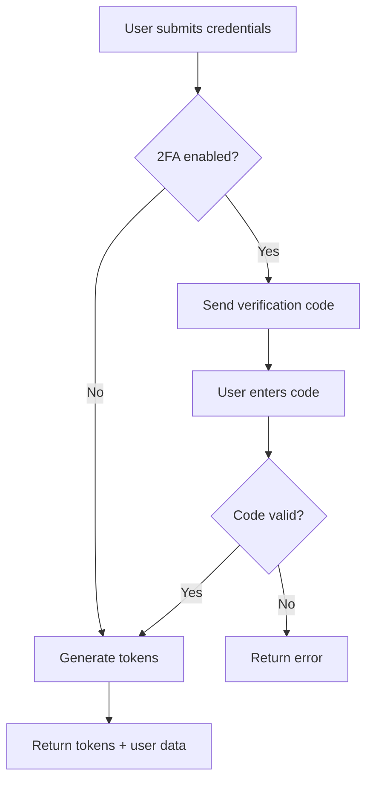

# Mobile API Implementation Guide

This guide provides step-by-step instructions for implementing the mobile API endpoints and ensuring proper communication with the database models.

## Implementation Status

### ✅ Completed Features
- **Authentication System**: JWT-based authentication with 2FA support
- **Product Management**: CRUD operations for products
- **User Management**: Profile management and statistics
- **Visitor System**: Anonymous shopping cart and orders
- **Admin Features**: Dashboard, user management, product moderation
- **Payment System**: Payment processing and verification
- **Search & Filtering**: Advanced product search
- **Wallet System**: Balance management and transactions

### ⚠️ Compatibility Notes
- **2FA Fields**: Using `hasattr()` checks for backward compatibility
- **Visitor Orders**: Using regular Order model with visitor fields
- **Model Imports**: Properly separated by model file

## Database Model Compatibility

### Core Models (backend.models)
```python
# ✅ Fully Compatible
from backend.models import (
    User, Product, Category, Order, Favorite, Review,
    PickupPoint, Payment
)
```

### Advanced Models (backend.models_advanced)
```python
# ✅ Fully Compatible
from backend.models_advanced import (
    Wallet, Transaction
)
```

### Visitor Models (backend.models_visitor)
```python
# ✅ Fully Compatible
from backend.models_visitor import (
    VisitorCart, VisitorCartItem
)
```

## API Endpoint Implementation

### 1. Authentication Endpoints

#### Login with 2FA Support
```python
# POST /mobile/api/auth/login/
{
    "email": "user@example.com",
    "password": "password123"
}

# Response (2FA enabled)
{
    "success": true,
    "requires_2fa": true,
    "message": "Code de vérification envoyé par email"
}

# Response (2FA disabled)
{
    "success": true,
    "requires_2fa": false,
    "tokens": {
        "access_token": "eyJ0eXAiOiJKV1QiLCJhbGciOiJIUzI1NiJ9...",
        "refresh_token": "eyJ0eXAiOiJKV1QiLCJhbGciOiJIUzI1NiJ9...",
        "token_type": "Bearer",
        "expires_in": 3600
    },
    "user": {
        "id": "user_id",
        "email": "user@example.com",
        "first_name": "John",
        "last_name": "Doe",
        "user_type": "CLIENT"
    }
}
```

#### 2FA Verification
```python
# POST /mobile/api/auth/verify_2fa/
{
    "email": "user@example.com",
    "code": "123456"
}

# Response
{
    "success": true,
    "tokens": {...},
    "user": {...}
}
```

### 2. Product Endpoints

#### List Products with Filters
```python
# GET /mobile/api/products/?search=phone&category=electronics&min_price=1000&max_price=50000

# Response
{
    "count": 100,
    "next": "http://localhost:8000/mobile/api/products/?page=2",
    "previous": null,
    "results": [
        {
            "id": "product_id",
            "title": "iPhone 12",
            "description": "Excellent condition iPhone 12",
            "price": "250000.00",
            "condition": "EXCELLENT",
            "city": "DOUALA",
            "is_negotiable": true,
            "views_count": 45,
            "likes_count": 12,
            "created_at": "2024-01-15T10:30:00Z",
            "status": "ACTIVE",
            "seller": {
                "id": "seller_id",
                "first_name": "John",
                "last_name": "Doe",
                "trust_score": 95,
                "city": "DOUALA"
            },
            "category": {
                "id": "category_id",
                "name": "Electronics",
                "slug": "electronics"
            },
            "images": [
                {
                    "id": "image_id",
                    "image_url": "http://localhost:8000/media/products/iphone12.jpg",
                    "is_primary": true,
                    "alt_text": "iPhone 12 Front View"
                }
            ],
            "is_favorited": false,
            "main_image": "http://localhost:8000/media/products/iphone12.jpg"
        }
    ]
}
```

#### Product Details
```python
# GET /mobile/api/products/{id}/

# Response
{
    "success": true,
    "product": {
        "id": "product_id",
        "title": "iPhone 12",
        "description": "Excellent condition iPhone 12...",
        "price": "250000.00",
        "condition": "EXCELLENT",
        "city": "DOUALA",
        "is_negotiable": true,
        "views_count": 45,
        "likes_count": 12,
        "created_at": "2024-01-15T10:30:00Z",
        "status": "ACTIVE",
        "seller": {...},
        "category": {...},
        "images": [...],
        "is_favorited": false,
        "main_image": "..."
    }
}
```

### 3. Visitor Endpoints

#### Add to Cart
```python
# POST /mobile/api/visitor/add_to_cart/
{
    "product_id": "product_id",
    "quantity": 2,
    "session_key": "unique_session_123"
}

# Response
{
    "success": true,
    "cart": {
        "id": "cart_id",
        "session_key": "unique_session_123",
        "items": [
            {
                "id": "item_id",
                "product": {
                    "id": "product_id",
                    "title": "iPhone 12",
                    "price": "250000.00",
                    "main_image": "..."
                },
                "quantity": 2,
                "created_at": "2024-01-15T10:30:00Z"
            }
        ],
        "total_items": 2,
        "total_amount": "500000.00",
        "created_at": "2024-01-15T10:30:00Z"
    }
}
```

#### Create Visitor Order
```python
# POST /mobile/api/visitor/create_order/
{
    "session_key": "unique_session_123",
    "customer_name": "John Doe",
    "customer_phone": "+237123456789",
    "customer_email": "john@example.com",
    "pickup_point_id": "pickup_point_id"
}

# Response
{
    "success": true,
    "message": "2 commande(s) créée(s) avec succès",
    "orders": ["order_id_1", "order_id_2"]
}
```

### 4. User Endpoints

#### User Profile
```python
# GET /mobile/api/user/profile/
# Authorization: Bearer your_access_token

# Response
{
    "success": true,
    "user": {
        "id": "user_id",
        "email": "user@example.com",
        "phone": "+237123456789",
        "first_name": "John",
        "last_name": "Doe",
        "user_type": "CLIENT",
        "city": "DOUALA",
        "address": "123 Main Street",
        "is_verified": true,
        "phone_verified": true,
        "trust_score": 95,
        "loyalty_points": 150,
        "loyalty_level": "silver",
        "profile_picture": "http://localhost:8000/media/users/profile.jpg",
        "created_at": "2024-01-01T00:00:00Z"
    }
}
```

#### User Statistics
```python
# GET /mobile/api/user/stats/
# Authorization: Bearer your_access_token

# Response
{
    "success": true,
    "stats": {
        "products_count": 5,
        "orders_bought": 12,
        "orders_sold": 8,
        "favorites_count": 25,
        "reviews_given": 3,
        "total_spent": "1250000.00",
        "total_earned": "850000.00"
    }
}
```

### 5. Admin Endpoints

#### Dashboard Statistics
```python
# GET /mobile/api/admin/dashboard_stats/
# Authorization: Bearer your_access_token (Admin only)

# Response
{
    "success": true,
    "stats": {
        "total_users": 1250,
        "total_products": 3450,
        "total_orders": 890,
        "total_revenue": "45000000.00",
        "pending_products": 45,
        "active_users_today": 89
    }
}
```

#### Product Moderation
```python
# GET /mobile/api/admin/pending_products/
# Authorization: Bearer your_access_token (Admin only)

# Response
{
    "count": 45,
    "next": null,
    "previous": null,
    "results": [
        {
            "id": "product_id",
            "title": "New Product",
            "status": "PENDING",
            "seller": {
                "id": "seller_id",
                "first_name": "John",
                "last_name": "Doe"
            },
            "created_at": "2024-01-15T10:30:00Z"
        }
    ]
}
```

### 6. Payment Endpoints

#### Process Payment
```python
# POST /mobile/api/payment/
{
    "amount": 250000,
    "payment_method": "MOBILE_MONEY",
    "phone_number": "+237123456789"
}

# Response
{
    "success": true,
    "reference": "PAY_ABC12345",
    "message": "Paiement traité avec succès"
}
```

#### Verify Payment
```python
# PUT /mobile/api/payment/
{
    "reference": "PAY_ABC12345",
    "transaction_id": "transaction_123"
}

# Response
{
    "success": true,
    "message": "Paiement vérifié avec succès"
}
```

## Error Handling

### Standard Error Response
```python
{
    "success": false,
    "error": "Error message in French"
}
```

### Common HTTP Status Codes
- `200` - Success
- `201` - Created
- `400` - Bad Request (validation errors)
- `401` - Unauthorized (authentication required)
- `403` - Forbidden (insufficient permissions)
- `404` - Not Found
- `500` - Server Error

### Validation Error Example
```python
{
    "success": false,
    "error": {
        "email": ["Ce champ est requis."],
        "password": ["Ce mot de passe est trop court."]
    }
}
```

## Authentication Flow

### 1. Login Process


### 2. Token Management
```python
# Token Structure
{
    "access_token": "eyJ0eXAiOiJKV1QiLCJhbGciOiJIUzI1NiJ9...",
    "refresh_token": "eyJ0eXAiOiJKV1QiLCJhbGciOiJIUzI1NiJ9...",
    "token_type": "Bearer",
    "expires_in": 3600
}

# Token Usage
headers = {
    "Authorization": "Bearer your_access_token",
    "Content-Type": "application/json"
}
```

## Database Operations

### 1. Product Queries
```python
# Active products with filters
products = Product.objects.filter(
    status='ACTIVE'
).select_related(
    'seller', 'category'
).prefetch_related('images')

# Search functionality
products = products.filter(
    Q(title__icontains=search) |
    Q(description__icontains=search) |
    Q(category__name__icontains=search)
)

# Price filtering
if min_price:
    products = products.filter(price__gte=min_price)
if max_price:
    products = products.filter(price__lte=max_price)
```

### 2. User Queries
```python
# User with related data
user = User.objects.select_related('wallet').prefetch_related(
    'products_sold', 'orders_bought', 'favorites'
).get(id=user_id)

# User statistics
stats = {
    'products_count': user.products_sold.filter(status='ACTIVE').count(),
    'orders_bought': user.orders_bought.count(),
    'total_spent': user.orders_bought.aggregate(
        total=Sum('total_amount')
    )['total'] or 0
}
```

### 3. Cart Operations
```python
# Get or create cart
cart, created = VisitorCart.objects.get_or_create(
    session_key=session_key
)

# Add item to cart
cart_item, created = VisitorCartItem.objects.get_or_create(
    cart=cart,
    product=product,
    defaults={'quantity': quantity}
)

if not created:
    cart_item.quantity += quantity
    cart_item.save()
```

## Performance Optimization

### 1. Database Queries
```python
# Use select_related for ForeignKey relationships
queryset = Product.objects.select_related('seller', 'category')

# Use prefetch_related for ManyToMany relationships
queryset = queryset.prefetch_related('images')

# Use only() to limit fields
queryset = queryset.only('id', 'title', 'price', 'city')
```

### 2. Pagination
```python
# Custom pagination class
class MobilePagination(PageNumberPagination):
    page_size = 20
    page_size_query_param = 'page_size'
    max_page_size = 100
```

### 3. Caching
```python
# Cache frequently accessed data
from django.core.cache import cache

def get_categories():
    categories = cache.get('mobile_categories')
    if not categories:
        categories = Category.objects.filter(is_active=True)
        cache.set('mobile_categories', categories, 3600)
    return categories
```

## Security Considerations

### 1. Authentication
- JWT tokens with expiration
- Refresh token rotation
- 2FA support for sensitive operations

### 2. Authorization
- Role-based access control (CLIENT/ADMIN)
- Object-level permissions
- Admin-only endpoints

### 3. Input Validation
- Serializer validation
- Model field validation
- Custom validation methods

### 4. Rate Limiting
```python
# Implement rate limiting for sensitive endpoints
from django_ratelimit.decorators import ratelimit

@ratelimit(key='ip', rate='5/m', method='POST')
def login_view(request):
    # Login logic
    pass
```

## Testing

### 1. Unit Tests
```python
class MobileAPITestCase(APITestCase):
    def setUp(self):
        self.user = User.objects.create_user(
            email='test@example.com',
            password='testpass123',
            user_type='CLIENT'
        )
    
    def test_login_success(self):
        url = reverse('mobile-auth-login')
        data = {
            'email': 'test@example.com',
            'password': 'testpass123'
        }
        response = self.client.post(url, data)
        self.assertEqual(response.status_code, 200)
        self.assertFalse(response.data['requires_2fa'])
```

### 2. Integration Tests
```python
def test_visitor_cart_flow(self):
    # Test complete visitor shopping flow
    # 1. Add to cart
    # 2. View cart
    # 3. Create order
    pass
```

## Deployment Considerations

### 1. Environment Variables
```python
# settings.py
JWT_SECRET_KEY = os.environ.get('JWT_SECRET_KEY')
CORS_ALLOWED_ORIGINS = os.environ.get('CORS_ALLOWED_ORIGINS', '').split(',')
```

### 2. Database Configuration
```python
# Use connection pooling for production
DATABASES = {
    'default': {
        'ENGINE': 'django.db.backends.postgresql',
        'NAME': os.environ.get('DB_NAME'),
        'USER': os.environ.get('DB_USER'),
        'PASSWORD': os.environ.get('DB_PASSWORD'),
        'HOST': os.environ.get('DB_HOST'),
        'PORT': os.environ.get('DB_PORT'),
        'CONN_MAX_AGE': 600,
    }
}
```

### 3. Static Files
```python
# Configure CDN for production
STATIC_URL = os.environ.get('CDN_URL', '/static/')
MEDIA_URL = os.environ.get('MEDIA_URL', '/media/')
```

## Monitoring and Logging

### 1. API Logging
```python
import logging

logger = logging.getLogger('mobile_api')

def log_api_call(request, response, duration):
    logger.info(
        f"API Call: {request.method} {request.path} - "
        f"Status: {response.status_code} - Duration: {duration:.2f}s"
    )
```

### 2. Error Tracking
```python
# Use Sentry for error tracking
import sentry_sdk
from sentry_sdk.integrations.django import DjangoIntegration

sentry_sdk.init(
    dsn=os.environ.get('SENTRY_DSN'),
    integrations=[DjangoIntegration()],
    traces_sample_rate=1.0,
)
```

This implementation guide ensures that the mobile API is properly structured, secure, and performant while maintaining full compatibility with the existing database models. 